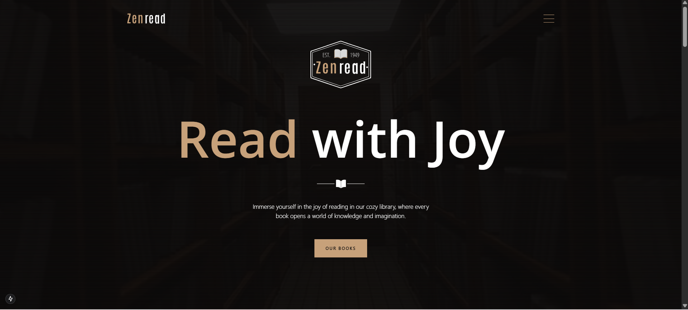
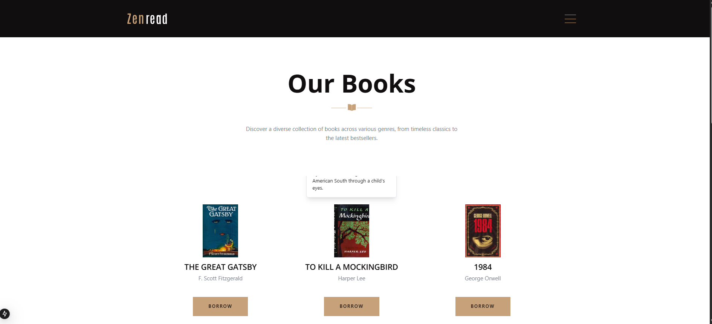

# 📚 MERN Library Management System

A full-stack web application that allows students to **borrow** and **return** books, built using the **MERN stack** (MongoDB, Express, React/Next.js, Node.js).

---
Demo:
 
 
---
## 🔧 Tech Stack

- **Frontend:** [Next.js](https://nextjs.org/)
- **Backend:** [Express.js](https://expressjs.com/)
- **Database:** [MongoDB](https://www.mongodb.com/) with [Mongoose](https://mongoosejs.com/)
- **API Testing:** Postman (for development & testing)

---

## 🚀 Features

- Student login and authentication (optional)
- View available books
- Borrow a book
- Return a borrowed book
- Real-time update of book availability
- MongoDB-powered data persistence

---

## 🗂️ Project Structure

